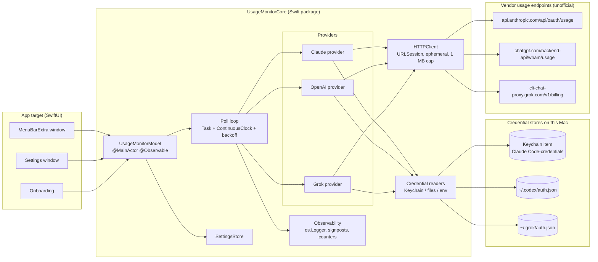
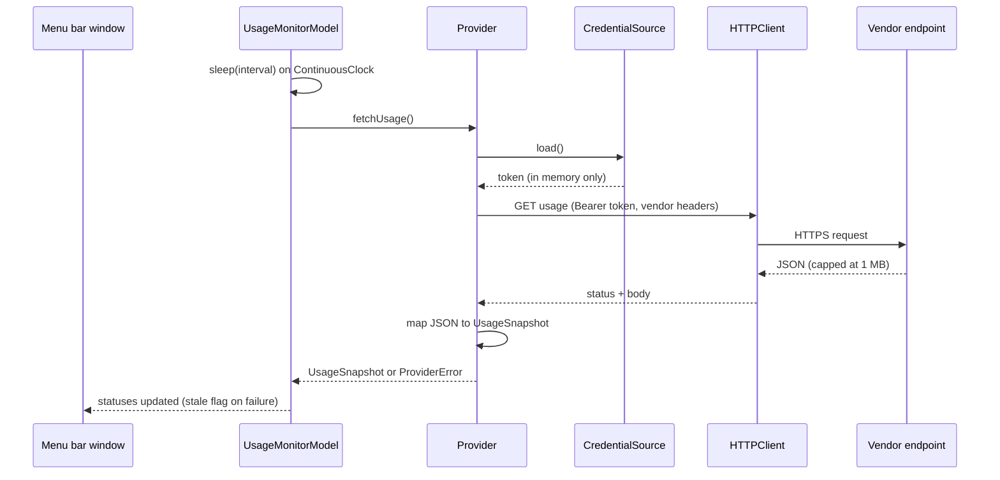
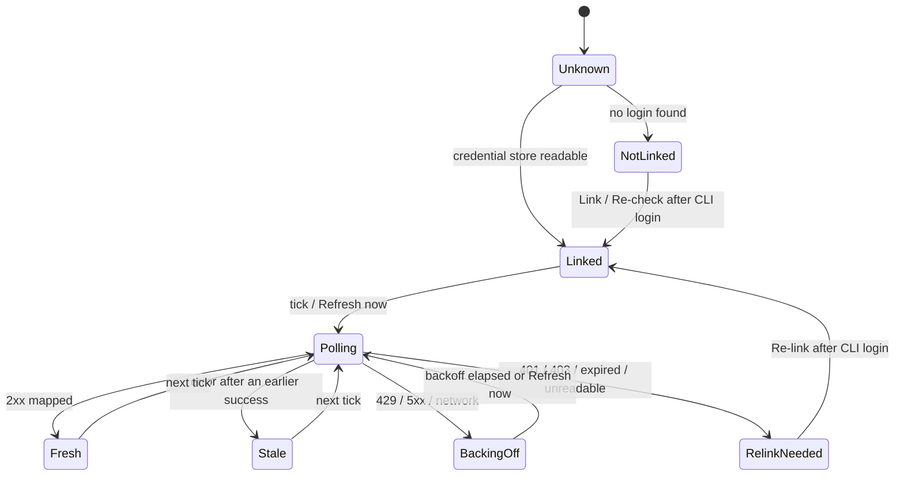

# AI Usage Monitor

<p align="center">
  
</p>

A macOS menu bar extra that shows how much of your **Claude**, **OpenAI (ChatGPT / Codex)** and
**Grok** subscription limits you have used, with session and weekly windows, reset times and your
plan name, refreshed in the background every few minutes.

**Status:** first release in progress. Build from source for now; notarised downloads and a
Homebrew tap are on the [roadmap](#roadmap).

[](https://github.com/jig21nesh/usage-monitor-app/actions/workflows/ci.yml)
[](LICENSE)


> **Unofficial.** None of these vendors publishes an API for subscription usage. This app reads
> the same undocumented endpoints their own command-line tools use, with the login those tools
> already store on your Mac. Endpoints can change or close without notice, and their use is at
> your discretion. See [Security and privacy](#security-and-privacy),
> [Terms of service](#terms-of-service) and
> [ADR 0003](docs/adr/0003-unofficial-usage-endpoints-and-terms-posture.md).

## Table of contents

- [Features](#features)
- [Requirements](#requirements)
- [Installation](#installation)
- [Quick start](#quick-start)
- [Usage](#usage)
- [Configuration](#configuration)
- [How it works](#how-it-works)
- [Architecture](#architecture)
- [Security and privacy](#security-and-privacy)
- [Terms of service](#terms-of-service)
- [Troubleshooting](#troubleshooting)
- [Development](#development)
- [Roadmap](#roadmap)
- [Contributing](#contributing)
- [License and trademarks](#license-and-trademarks)

## Features

<!-- Optional screenshot. Add docs/images/panel.png and uncomment:

-->

- Lives in the menu bar with no Dock icon. Click the icon for every linked provider at a glance.
- **Claude:** current 5-hour session, weekly "all models" and weekly per-model windows (for
  example a separate bar for the top model on your plan), each with a "Resets in 4 hr 50 min"
  style countdown, plus your plan name such as "Max (20x)".
- **OpenAI:** the 5-hour and weekly ChatGPT / Codex windows with reset time and plan type, plus
  any per-model limits the account carries.
- **Grok (experimental):** weekly credit usage percent, period end and subscription tier.
- Choose which providers to show and how often to refresh (1, 2, 5, 10 or 15 minutes).
- Per-provider backoff on rate limits and outages; the last good numbers stay visible, marked
  stale, until the next successful refresh.
- Re-link a provider from Settings after you sign in to its CLI again.
- Optional launch at login.
- No accounts, no telemetry, no stored tokens. Diagnostics stay on your Mac.

## Requirements

- macOS 26 (Tahoe) or later. macOS 27 is supported. Apple silicon or Intel.
- At least one of the vendor CLIs installed and signed in on this Mac:
  - [Claude Code](https://docs.claude.com/en/docs/claude-code) (`claude login`) on a Pro or Max
    plan
  - [Codex CLI](https://github.com/openai/codex) (`codex login`) using ChatGPT sign-in with the
    default file credential storage
  - [Grok Build CLI](https://x.ai/news/grok-build-cli) (`grok login`)
- To build from source: Xcode 26.6 or later, [XcodeGen](https://github.com/yonaskolb/XcodeGen)
  and [SwiftLint](https://github.com/realm/SwiftLint).

## Installation

Pre-built, notarised releases and a Homebrew tap are planned. Until then, build from source:

```sh
brew install xcodegen swiftlint
git clone https://github.com/jig21nesh/usage-monitor-app.git
cd usage-monitor-app
cp Config/Local.xcconfig.example Config/Local.xcconfig   # set DEVELOPMENT_TEAM to your team id
scripts/bootstrap.sh                                      # generates UsageMonitor.xcodeproj
open UsageMonitor.xcodeproj                               # Product > Run
```

The generated Xcode project and your local signing config are gitignored on purpose; see
[Development](#development).

## Quick start

1. Launch the app. The onboarding window lists the three providers and shows which CLI sign-ins
   were detected on this Mac.
2. Click **Link** next to each provider you want to monitor. For Claude, macOS may ask whether
   the app can read the "Claude Code-credentials" item in your keychain; choose **Always Allow**
   so the question is not repeated on every refresh.
3. Tick **Launch at login** if you want the monitor to start with your Mac, then close the
   window. The app keeps running in the menu bar.
4. Click the menu bar icon to open the usage panel. **Refresh now** forces an immediate update.

If a provider later shows **Re-link needed**, run that CLI's login command again and click
**Re-link** in Settings. The app never refreshes vendor tokens itself.

## Usage

The panel shows one section per enabled provider:

| Element | Meaning |
|---|---|
| Plan badge | Plan or tier reported by the vendor, for example "Max (20x)", "Pro", "SuperGrok" |
| Bar and percentage | Share of the window used (the OpenAI section can also show percent left) |
| "Resets in …" / "Resets Mon 3:00 AM" | When the window rolls over, in your local time zone |
| "stale" | The most recent refresh failed; the numbers are from the last successful one |
| Message instead of bars | The provider is not linked or needs re-linking; the login command is shown |

Buttons at the bottom: **Refresh now**, **Settings…** and **Quit**.

## Configuration

Open **Settings…** from the panel.

| Tab | What it does |
|---|---|
| Accounts | Link state, plan and credential source per provider; **Re-link** after signing in to a CLI again; shows the login command |
| Providers | Choose which providers appear in the panel |
| Refresh | Refresh interval (1, 2, 5, 10 or 15 minutes; default 2), percentages shown as used or left, and **Launch at login** |
| Diagnostics | Poll counts, last error and duration per provider, plus a redacted text report you can attach to bug reports |

Behaviour worth knowing:

- **Backoff.** When a provider returns a rate limit (HTTP 429) or a server error, that provider
  alone backs off for 3, 6, 12 and then 15 minutes between attempts, honouring a longer
  `Retry-After` if the vendor sends one, up to one hour. **Refresh now** always tries again.
- **Wake from sleep.** The first refresh after your Mac wakes fires promptly instead of waiting
  for the next tick.
- **Storage.** Settings live in `UserDefaults`. No credential is ever stored by the app.

## How it works

Each provider is an isolated adapter that reads the vendor CLI's stored login at poll time, makes
one read-only HTTPS request, and maps the JSON to a snapshot. Tokens are held in memory for the
duration of that request and discarded.

| | Claude | OpenAI | Grok (experimental) |
|---|---|---|---|
| Credential source | Keychain item `Claude Code-credentials` written by Claude Code; `CLAUDE_CODE_OAUTH_TOKEN` environment variable as fallback | `~/.codex/auth.json` written by `codex login` (`CODEX_HOME` honoured when absolute) | `~/.grok/auth.json` written by `grok login` (`GROK_HOME` honoured when absolute) |
| Endpoint | `GET https://api.anthropic.com/api/oauth/usage` | `GET https://chatgpt.com/backend-api/wham/usage` | `GET https://cli-chat-proxy.grok.com/v1/billing?format=credits` |
| Headers sent | `Authorization: Bearer …`, `anthropic-beta: oauth-2025-04-20`, `Accept: application/json`, `User-Agent: claude-cli/<version> (external, cli)` | `Authorization: Bearer …`, `ChatGPT-Account-Id`, `Accept: application/json`, `User-Agent: AIUsageMonitor/<version> (macOS)` | `Authorization: Bearer …`, `X-XAI-Token-Auth: xai-grok-cli`, `x-grok-client-version`, `x-userid`, `Accept: application/json` |
| Windows shown | `limits[]`: session (5 h), weekly all models, weekly per model; falls back to `five_hour` / `seven_day` | `primary_window` / `secondary_window` classified by `limit_window_seconds` (18000 = 5-hour session, 604800 = weekly), plus per-model `additional_rate_limits` | `config.creditUsagePercent` for the current period, period end as reset time |
| Plan name | Subscription type and rate-limit tier from the stored login | `chatgpt_plan_type` claim from the stored identity token | `subscriptionTier` from the response |
| Token lifetime | About 8 hours; Claude Code refreshes it | About 10 days; Codex refreshes it | About 6 hours; Grok Build refreshes it only when it runs |
| Notes | A Claude-Code-style `User-Agent` is required; other user agents fall into a much stricter rate-limit bucket. Measured: 60-second polling returned HTTP 200 throughout | Never classify windows by position: Plus accounts can carry only the weekly window in `primary_window` | HTTP 426 means the vendor now requires a newer client version. Zero-valued numbers are omitted from the JSON and read as 0 |

Common to all three: responses are capped at 1 MB, HTTP 401 and 403 mark the provider as needing
re-link, 429 and 5xx trigger backoff, and unknown JSON keys are ignored so vendor additions do
not break parsing. The app never calls inference endpoints and never refreshes or rotates a
token, because rotating from a second process logs the CLI out.

## Architecture

The app is a thin SwiftUI target over a local Swift package, `UsageMonitorCore`, that owns all
logic and carries the test suite. Decisions are recorded as Architecture Decision Records in
[`docs/adr`](docs/adr/README.md).



One poll cycle:



Lifecycle of one provider's status:



Key points:

- Providers are isolated adapters: a credential source, one read-only request and a pure mapper
  with recorded JSON fixtures. Endpoint drift breaks one adapter and its tests, not the app.
- All effects sit behind protocols (`HTTPClient`, `CredentialSource`, `KeychainReader`,
  `FileSystem`, `SettingsStore`, `Sleeper`) with in-memory fakes, which is how the package keeps
  its 90% coverage gate without signing or a GUI.
- Failures degrade per provider: the last successful snapshot stays visible, marked stale, while
  that provider backs off.
- The poll loop is a cancellable `Task` sleeping on `ContinuousClock` with tolerance, so it
  survives system sleep, coalesces with other timers, and never uses `Timer`.

Project layout:

```text
App/                         SwiftUI scenes and views only (MenuBarExtra, Settings, onboarding)
Packages/UsageMonitorCore/   All logic, tested with Swift Testing
  Sources/UsageMonitorCore/
    Domain/                  ProviderID, UsageWindow, UsageSnapshot, ProviderStatus, ProviderError
    Providers/<Vendor>/      Credential source + client + mapper per vendor
    Credentials/             KeychainReader, FileSystem, UserEnvironment, JWTClaims
    Networking/              HTTPClient, URLSessionHTTPClient, status-to-error mapping
    Polling/                 UsageMonitorModel, BackoffPolicy, Sleeper, ProviderDiagnostics
    Settings/                AppSettings, SettingsStore
    Formatting/              Reset-time and vendor date formatting
    Observability/           UsageLog, Redactor
  Tests/UsageMonitorCoreTests/  Suites, fakes and JSON fixtures per vendor
UITests/                     XCUITest smoke suite
docs/adr/                    Architecture Decision Records
scripts/                     bootstrap.sh (XcodeGen), coverage-gate.sh
project.yml                  XcodeGen spec; UsageMonitor.xcodeproj is generated and gitignored
```

## Security and privacy

- The app **never stores** a vendor token, cookie or refresh token. It reads the credential the
  vendor's own CLI stored, uses it for one request, and discards it.
- It **never refreshes or rotates** tokens and **never calls inference endpoints**.
- Outbound HTTPS only, under App Transport Security, with an ephemeral, cookie-less session and
  a 1 MB response cap.
- Hardened Runtime is on. App Sandbox is on, with read-only exceptions limited to
  `~/.codex/auth.json` and `~/.grok/auth.json`; the keychain item is read through the normal
  macOS consent mechanism.
- Logs and the Diagnostics report are redacted at source: provider ids, status codes and
  durations only, never tokens, response bodies or account identifiers. Nothing leaves your Mac.
- Threat model in one line: the new attack surface is read-only access to three credential
  stores you already trust those CLIs with, plus three outbound HTTPS calls.

Details: [SECURITY.md](SECURITY.md),
[ADR 0002](docs/adr/0002-reuse-official-cli-credentials-no-token-persistence.md),
[ADR 0004](docs/adr/0004-app-sandbox-with-read-only-exceptions.md),
[ADR 0006](docs/adr/0006-local-only-observability.md).

## Terms of service

All three vendors' consumer terms restrict automated access. This project performs low-rate,
read-only requests with your own login, which is a grey area none of the vendors has explicitly
sanctioned. You choose per provider whether to opt in, and you can unlink at any time. The
maintainers accept that risk for the project, not on your behalf. See
[ADR 0003](docs/adr/0003-unofficial-usage-endpoints-and-terms-posture.md).

## Troubleshooting

| Symptom | Cause | What to do |
|---|---|---|
| **Not linked** | The vendor CLI is not installed, or you have not signed in | Install the CLI, run its login command (`claude login`, `codex login`, `grok login`), then **Link** or **Re-check** |
| **Re-link needed** | The stored token expired or the vendor rejected it | Sign in with the CLI again, then **Re-link** in Settings. The app never refreshes tokens itself |
| OpenAI stays not linked although Codex works | Codex is storing credentials in the system keyring instead of `~/.codex/auth.json` | Not supported yet; see [Roadmap](#roadmap). Switch Codex back to file storage or wait for keyring support |
| Custom `CODEX_HOME` or `GROK_HOME` is ignored | Under App Sandbox only the default paths are readable; relative or empty overrides are always ignored | Keep the default locations, or run an unsandboxed development build |
| Grok shows "requires a newer client" | The billing endpoint returned HTTP 426 (client version gate) | Update the app; if the latest version is affected, open a [provider endpoint issue](https://github.com/jig21nesh/usage-monitor-app/issues/new/choose) |
| Claude shows "rate limited" | HTTP 429 from the usage endpoint | Nothing to do; backoff handles it. Choose a longer refresh interval if it recurs |
| macOS keeps asking for keychain access | **Allow** was chosen instead of **Always Allow** | Choose **Always Allow** next time, or remove and re-add the app's entry in Keychain Access |
| Settings window does not appear | Background apps have no Dock icon to activate | Click the menu bar icon and choose **Settings…** again; the app activates itself first |
| Numbers look frozen | The provider is in backoff or stale | Open the panel: a **stale** badge or the Diagnostics tab shows the last error and the next retry |

## Development

```sh
brew install xcodegen swiftlint
cp Config/Local.xcconfig.example Config/Local.xcconfig   # set DEVELOPMENT_TEAM
scripts/bootstrap.sh                                      # xcodegen generate
open UsageMonitor.xcodeproj
```

Core tests and the coverage gate need no code signing:

```sh
swift test --package-path Packages/UsageMonitorCore --enable-code-coverage
scripts/coverage-gate.sh          # fails below 90% line coverage on UsageMonitorCore
swiftlint lint --strict
```

Full scheme including the UI smoke tests:

```sh
xcodebuild -project UsageMonitor.xcodeproj -scheme UsageMonitor -destination 'platform=macOS' test
```

Markdown is linted too:

```sh
npx markdownlint-cli2
```

Conventions:

- Swift 6 language mode with strict concurrency; warnings are errors. The app target uses
  MainActor default isolation; Core is nonisolated by default.
- Every provider ships fixtures for the happy path, missing optional fields, malformed JSON, an
  oversized body and 401 / 403 / 429 / 5xx, plus tests that no error text ever contains a token.
- Read the [ADR index](docs/adr/README.md) before changing provider, credential, sandbox,
  testing or observability behaviour, and write a new ADR for any new pattern or trade-off.
- Project rules for contributors and AI assistants live in [`CLAUDE.md`](CLAUDE.md).

### App icon

The icon is drawn in code so it can be regenerated and reviewed in a pull request:

```sh
swift scripts/generate-app-icon.swift App/Assets.xcassets/AppIcon.appiconset
```

## Roadmap

- Notarised release builds, Sparkle updates and a Homebrew tap.
- Support for Codex keyring credential storage.
- Menu bar icon that reflects the most-used window.
- Optional notifications when a window crosses a threshold.
- Localisation.

## Contributing

Issues and pull requests are welcome. Please read [CONTRIBUTING.md](CONTRIBUTING.md) and the
[Code of Conduct](CODE_OF_CONDUCT.md) first, and use the issue templates so reports include the
macOS, Xcode and CLI versions plus a redacted Diagnostics report.

## License and trademarks

[MIT](LICENSE). Copyright (c) 2026 Jignesh Kakkad.

Claude is a trademark of Anthropic, PBC. ChatGPT and Codex are trademarks of OpenAI. Grok is a
trademark of xAI. This project is not affiliated with or endorsed by any of them.
