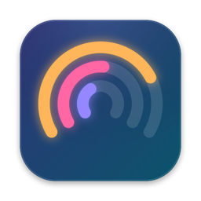
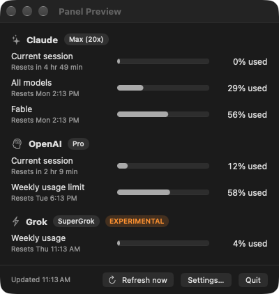
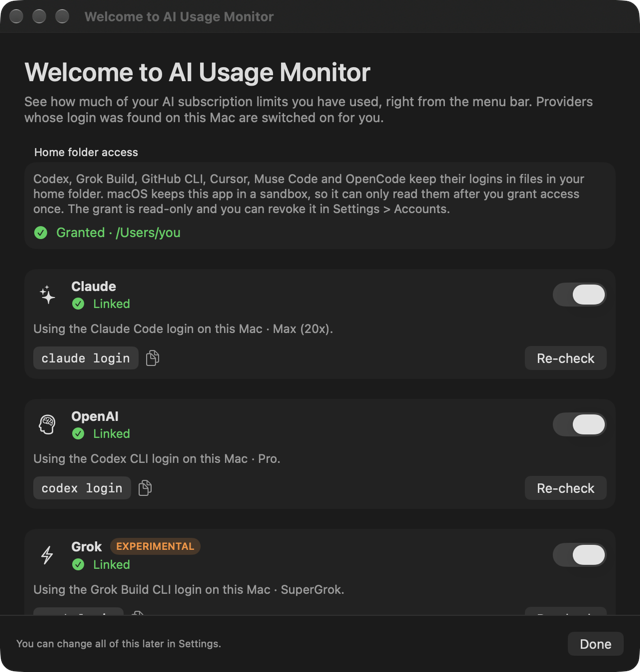
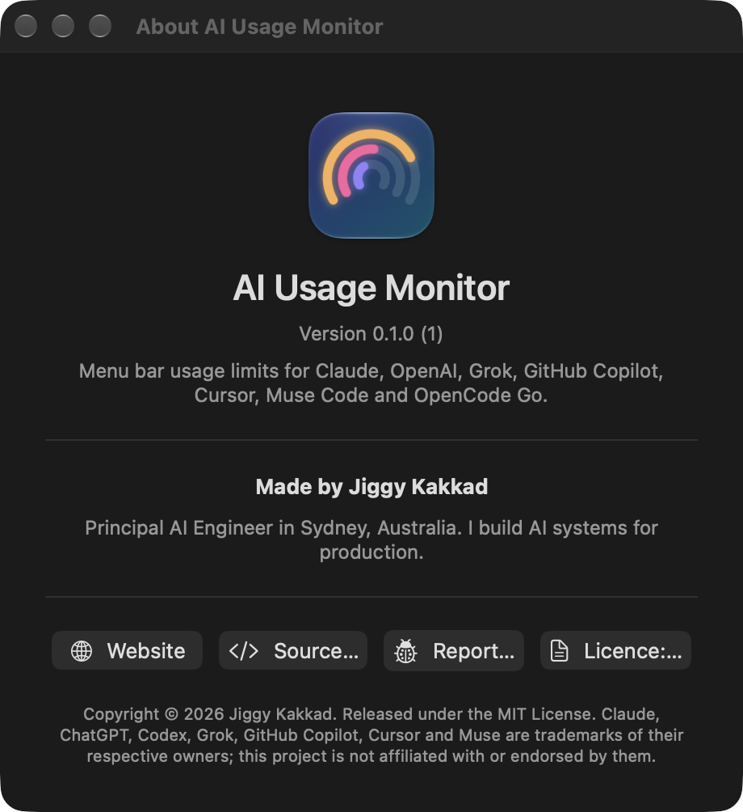
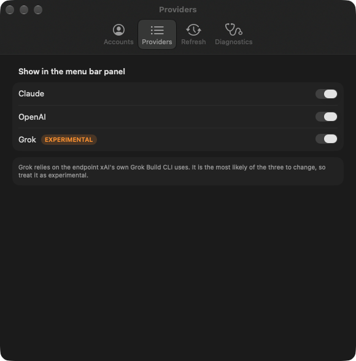
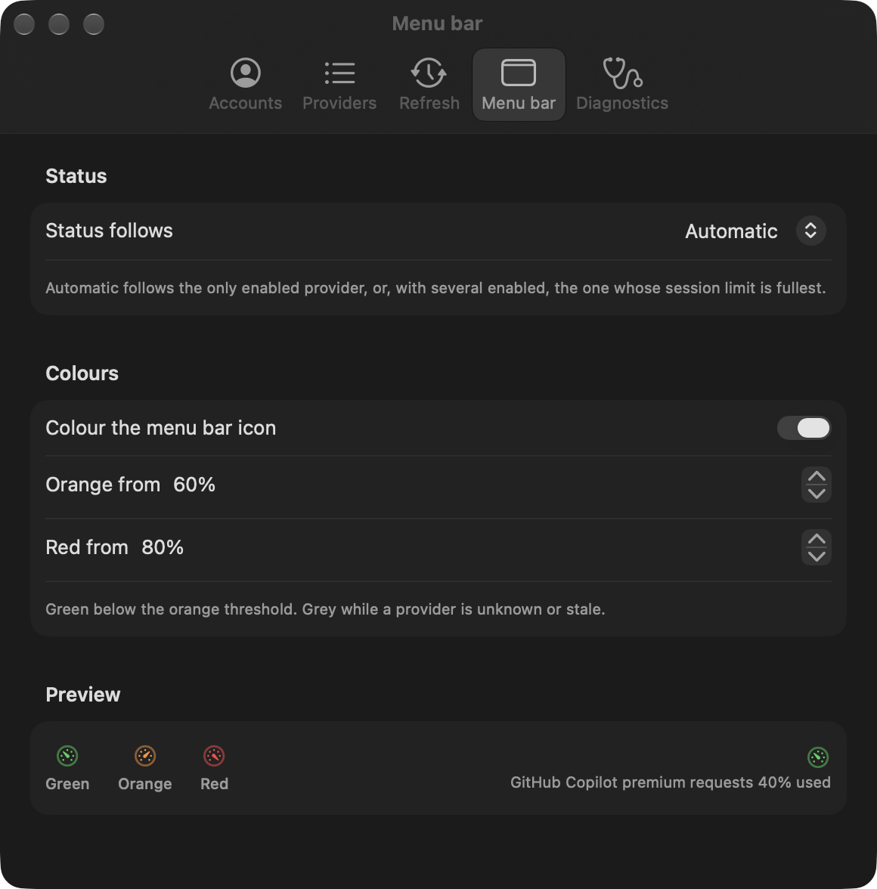
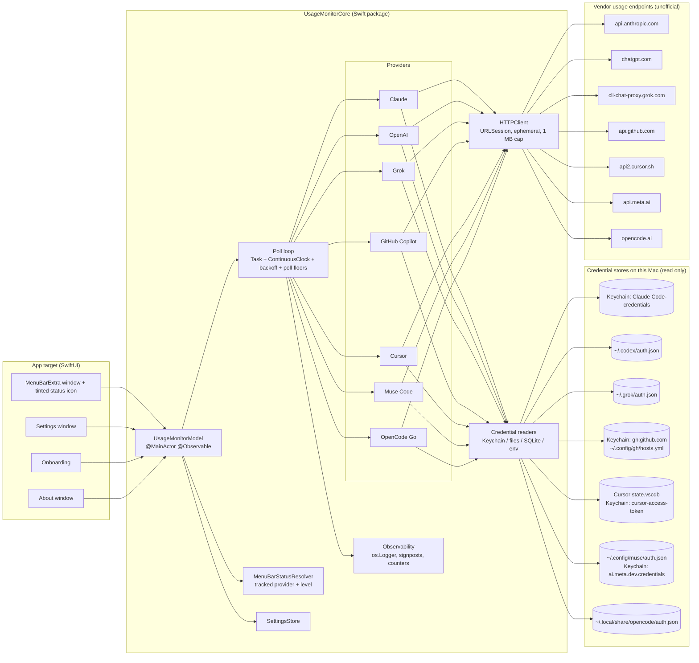
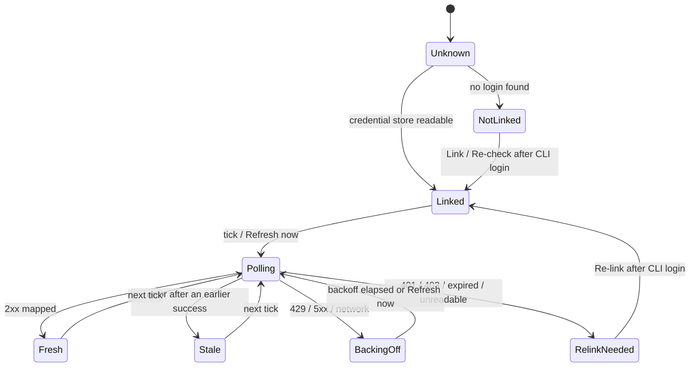

# AI Usage Monitor

<p align="center">
  
</p>

A macOS menu bar extra that shows how much of your AI subscription limits you have used, for
**Claude**, **OpenAI (ChatGPT / Codex)**, **Grok**, **GitHub Copilot**, **Cursor**,
**Muse Code (Meta)** and **OpenCode Go**: session, weekly and monthly windows, reset times and
your plan name, refreshed in the background every few minutes. The menu bar icon turns green,
orange or red as the limit you care about fills up.

**Status:** first release in progress. Downloads are unsigned until the project has an Apple
Developer ID; see [Installation](#installation).

[](https://github.com/jig21nesh/usage-monitor-app/actions/workflows/ci.yml)
[](LICENSE)


> **Unofficial.** None of these vendors publishes an API for subscription usage. This app reads
> the same undocumented endpoints their own command-line tools and apps use, with the login those
> tools already store on your Mac. Endpoints can change or close without notice, and their use
> is at your discretion. See [Security and privacy](#security-and-privacy),
> [Terms of service](#terms-of-service) and
> [ADR 0003](docs/adr/0003-unofficial-usage-endpoints-and-terms-posture.md).

## Table of contents

- [Features](#features)
- [Requirements](#requirements)
- [Installation](#installation)
- [Quick start](#quick-start)
- [Usage](#usage)
- [Configuration](#configuration)
- [How it works](#how-it-works)
- [Architecture](#architecture)
- [Security and privacy](#security-and-privacy)
- [Terms of service](#terms-of-service)
- [Troubleshooting](#troubleshooting)
- [Development](#development)
- [Roadmap](#roadmap)
- [Contributing](#contributing)
- [License and trademarks](#license-and-trademarks)

## Features

<p align="center">
  
</p>

*Panel shown with the app's built-in demo data; your numbers come from your own accounts.*

- Lives in the menu bar with no Dock icon. Click the icon for every enabled provider at a glance.
- **Claude:** current 5-hour session, weekly "all models" and weekly per-model windows, each with
  a "Resets in 4 hr 50 min" style countdown, plus your plan name such as "Max (20x)".
- **OpenAI:** the 5-hour and weekly ChatGPT / Codex windows with reset time and plan type, plus
  any per-model limits the account carries.
- **GitHub Copilot:** monthly premium requests, plus chat and completions when they are metered.
- **OpenCode Go:** rolling 5-hour, weekly and monthly windows of the Go plan.
- **Grok (experimental):** weekly credit usage percent, period end and subscription tier.
- **Cursor (experimental):** included usage for the current billing cycle, plus on-demand
  spend when a limit is set.
- **Muse Code (experimental):** Meta's terminal coding agent; 5-hour and weekly windows.
- **Colour-coded menu bar icon:** green, orange or red for the provider you choose to track,
  with thresholds you can change; grey while the number is unknown or stale.
- Choose which providers to show and how often to refresh (1, 2, 5, 10 or 15 minutes).
- Per-provider backoff on rate limits and outages; the last good numbers stay visible, marked
  stale, until the next successful refresh.
- Re-link a provider from Settings after you sign in to its CLI again.
- Optional launch at login, an About window, and a DMG installer.
- No accounts, no telemetry, no stored tokens. Diagnostics stay on your Mac.

## Requirements

- macOS 26 (Tahoe) or later. macOS 27 is supported. Apple silicon or Intel.
- At least one of the vendor tools installed and signed in on this Mac:

| Provider | Tool the app reads | Sign in with |
|---|---|---|
| Claude | [Claude Code](https://docs.claude.com/en/docs/claude-code), Pro or Max plan | `claude login` |
| OpenAI | [Codex CLI](https://github.com/openai/codex) with ChatGPT sign-in and the default file credential storage | `codex login` |
| Grok | [Grok Build CLI](https://x.ai/news/grok-build-cli) | `grok login` |
| GitHub Copilot | [GitHub CLI](https://cli.github.com) (or the Copilot CLI) on an account with a Copilot seat | `gh auth login` |
| Cursor | [Cursor](https://cursor.com) app, or the `cursor-agent` CLI | Sign in to Cursor, or `cursor-agent login` |
| Muse Code | [Muse Code CLI](https://dev.meta.ai/docs/muse-code) with a Muse Code subscription | `muse login` |
| OpenCode Go | [OpenCode](https://opencode.ai) CLI with a Go plan | `opencode auth login` |

- To build from source: Xcode 26.6 or later, [XcodeGen](https://github.com/yonaskolb/XcodeGen)
  and [SwiftLint](https://github.com/realm/SwiftLint).

## Installation

### From a release DMG

1. Download the latest `AIUsageMonitor-<version>.dmg` from the
   [Releases page](https://github.com/jig21nesh/usage-monitor-app/releases).
2. Open the DMG and drag **AI Usage Monitor** onto the **Applications** shortcut.
3. Eject the DMG and launch the app from Applications.

**Builds are currently unsigned** (the file name ends in `-unsigned.dmg`). Until the project has
an Apple Developer ID, macOS refuses to open the app the first time. To allow it once:

1. Double-click the app; macOS says it cannot verify the developer. Click **Done**.
2. Open **System Settings > Privacy & Security**, scroll to **Security**, and click
   **Open Anyway** next to the message about AI Usage Monitor (the button stays for about an
   hour).
3. Confirm with your login password. The app opens and macOS remembers the decision.

Optional: verify the download against the checksum published with the release:

```sh
shasum -a 256 -c AIUsageMonitor-<version>-unsigned.dmg.sha256
```

Release builds are produced by `scripts/build-dmg.sh` and the `Release` GitHub Actions
workflow; maintainers should read [docs/RELEASING.md](docs/RELEASING.md) for signing,
notarisation and tagging.

### From source

```sh
brew install xcodegen swiftlint
git clone https://github.com/jig21nesh/usage-monitor-app.git
cd usage-monitor-app
cp Config/Local.xcconfig.example Config/Local.xcconfig   # set DEVELOPMENT_TEAM to your team id
scripts/bootstrap.sh                                      # generates UsageMonitor.xcodeproj
open UsageMonitor.xcodeproj                               # Product > Run
```

To produce your own DMG instead: `scripts/build-dmg.sh` (add `--dry-run` to see the plan).

The generated Xcode project and your local signing config are gitignored on purpose; see
[Development](#development).

## Quick start

1. Launch the app. The Welcome window lists all seven providers, shows which logins it found on
   this Mac, and switches those providers on for you. Use the **Show** switch on each card to
   change that, and **Re-check** after you sign in to a tool.

   
2. For Claude, macOS may ask whether the app can read the "Claude Code-credentials" item in your
   keychain; choose **Always Allow** so the question is not repeated on every refresh.
3. Tick **Launch at login** if you want the monitor to start with your Mac, then click **Done**.
   The app keeps running in the menu bar.
4. Click the menu bar icon to open the usage panel. **Refresh now** forces an immediate update.

If a provider later shows **Re-link needed**, run that tool's login command again and click
**Re-link** in Settings. The app never refreshes vendor tokens itself.

## Usage

The panel shows one section per enabled provider:

| Element | Meaning |
|---|---|
| Plan badge | Plan or tier reported by the vendor, for example "Max (20x)", "Pro", "SuperGrok", "Go" |
| Bar and percentage | Share of the window used, or left if you prefer (Settings > Refresh) |
| "Resets in …" / "Resets Mon 3:00 AM" | When the window rolls over, in your local time zone |
| "Experimental" tag | Grok, Cursor and Muse Code: the newest, least documented endpoints |
| "stale" | The most recent refresh failed; the numbers are from the last successful one |
| Message instead of bars | The provider is not linked or needs re-linking; the login command is shown |

Buttons at the bottom: the **info** button opens About, then **Refresh now**, **Settings…**
and **Quit**.

### About

The About window (info button in the panel, or Settings > Diagnostics > **About…**) shows the
app version, who makes it, and links to the website, the source on GitHub, the issue tracker
and the MIT licence.



## Configuration

Open **Settings…** from the panel.



| Tab | What it does |
|---|---|
| Accounts | Per provider: status, plan, credential source, account label, last success, last error, the sign-in command with a Copy button, and **Re-link**. **Show welcome again** reopens the Welcome window |
| Providers | **Show** switches for the seven providers; experimental ones are tagged |
| Refresh | Refresh interval (1, 2, 5, 10 or 15 minutes; default 2), last and next refresh, **Refresh now**, **Show percentages as** used or left, **Launch at login** |
| Menu bar | **Status follows** (Automatic or one enabled provider), **Colour the menu bar icon**, **Orange from** and **Red from** thresholds in 5% steps, and a live preview |
| Diagnostics | Poll counts, last error and duration per provider, app and macOS version, **About…**, and **Copy report** for a redacted text report you can attach to bug reports |



### Menu bar colour

The icon is a gauge whose needle follows the tracked window and whose colour follows the
thresholds: **green** below the orange threshold, **orange** from 60% used, **red** from 80%
used (defaults; editable in 5% steps). It turns **grey** while the tracked provider is unknown
or its numbers are stale. The tracked provider is the one you choose under **Status follows**;
in **Automatic** mode it is the only enabled provider, or, with several enabled, the one whose
session window is fullest. Switch **Colour the menu bar icon** off for the standard monochrome
template icon.

Behaviour worth knowing:

- **Backoff.** When a provider returns a rate limit (HTTP 429) or a server error, that provider
  alone backs off for 3, 6, 12 and then 15 minutes between attempts, honouring a longer
  `Retry-After` if the vendor sends one, up to one hour. **Refresh now** always tries again.
- **Poll floors.** Muse Code is polled at most every 15 minutes whatever the interval, because
  its endpoint is the least understood (see below).
- **Wake from sleep.** The first refresh after your Mac wakes fires promptly instead of waiting
  for the next tick.
- **Defaults.** A fresh install enables Claude, OpenAI and Grok; the Welcome window then
  enables exactly the providers whose login it detected.
- **Storage.** Settings live in `UserDefaults`. No credential is ever stored by the app.

## How it works

Each provider is an isolated adapter that reads the vendor tool's stored login at poll time,
makes one read-only HTTPS request, and maps the JSON to a snapshot. Tokens are held in memory
for the duration of that request and discarded. Every request carries
`User-Agent: AIUsageMonitor/<version> (macOS)` and `Accept: application/json` unless the vendor
requires its own user agent; the tables below list the other headers.

| Provider | Credential source | Request | Windows shown | Plan name |
|---|---|---|---|---|
| Claude | Keychain item `Claude Code-credentials` written by Claude Code; `CLAUDE_CODE_OAUTH_TOKEN` environment variable as fallback | `GET https://api.anthropic.com/api/oauth/usage` with `Authorization: Bearer`, `anthropic-beta: oauth-2025-04-20`, `User-Agent: claude-cli/<version> (external, cli)` | `limits[]`: session (5 h), weekly all models, weekly per model; falls back to `five_hour` / `seven_day` | Subscription type and rate-limit tier from the stored login |
| OpenAI | `~/.codex/auth.json` written by `codex login` (`CODEX_HOME` honoured when absolute) | `GET https://chatgpt.com/backend-api/wham/usage` with `Authorization: Bearer`, `ChatGPT-Account-Id` | `primary_window` / `secondary_window` classified by `limit_window_seconds` (18000 = 5-hour session, 604800 = weekly), plus per-model `additional_rate_limits` | `chatgpt_plan_type` claim from the stored identity token |
| Grok | `~/.grok/auth.json` written by `grok login` (`GROK_HOME` honoured when absolute) | `GET https://cli-chat-proxy.grok.com/v1/billing?format=credits` with `Authorization: Bearer`, `X-XAI-Token-Auth: xai-grok-cli`, `x-grok-client-version`, `x-userid` | `config.creditUsagePercent` for the current period, period end as reset time | `subscriptionTier` from the response |
| GitHub Copilot | Keychain item `gh:github.com` written by `gh auth login`; then `~/.config/gh/hosts.yml` (`GH_CONFIG_DIR` honoured when absolute); then keychain item `copilot-cli`; then `GH_TOKEN` / `GITHUB_TOKEN` | `GET https://api.github.com/copilot_internal/user` with `Authorization: token` | `quota_snapshots.premium_interactions` as "Premium requests" (monthly), plus "Chat" and "Completions" when not unlimited; reset from `quota_reset_date_utc` | `copilot_plan` (`individual` = Pro, `individual_pro` = Pro+, Business, Enterprise, Free) |
| Cursor | `cursorAuth/accessToken` in Cursor's `~/Library/Application Support/Cursor/User/globalStorage/state.vscdb` (read-only SQLite); then keychain item `cursor-access-token`; then `~/.cursor/auth.json` | `POST https://api2.cursor.sh/aiserver.v1.DashboardService/GetCurrentPeriodUsage` with `Authorization: Bearer`, `Content-Type: application/json`, `Connect-Protocol-Version: 1`, body `{}` | `planUsage` as "Included usage" (billing cycle), plus "On-demand usage" when `spendLimitUsage` carries a limit; reset at `billingCycleEnd` | `cursorAuth/stripeMembershipType` from the same store (Pro, Pro+, Ultra, Free) |
| Muse Code | `~/.config/muse/auth.json` (`MUSE_AUTH_PATH` or `XDG_CONFIG_HOME` honoured when absolute), else keychain item `ai.meta.dev.credentials`; only `dca:` OAuth tokens | `POST https://api.meta.ai/muse-code/key` with `Authorization: Bearer`, `x-api-version: 1.0.0`, `Content-Type: application/json`, body `{}` | `subs_usage.window` as "Current session" (5 h) and `subs_usage.weekly` as "Weekly limit"; no bars while the account is pay-as-you-go | `subs_tier_name` from the response |
| OpenCode Go | `~/.local/share/opencode/auth.json` (`XDG_DATA_HOME` honoured when absolute), entry `opencode-go` | `GET https://opencode.ai/zen/go/v1/usage` with `Authorization: Bearer` | `usage.rolling` as "Current session" (5 h), `usage.weekly` as "Weekly limit", `usage.monthly` as "Monthly limit" | Always "Go" |

| Provider | Token lifetime and refresh | Notes |
|---|---|---|
| Claude | About 8 hours; Claude Code refreshes it | A Claude-Code-style `User-Agent` is required; other user agents fall into a much stricter rate-limit bucket. Measured: 60-second polling returned HTTP 200 throughout |
| OpenAI | About 10 days; Codex refreshes it | Never classify windows by position: Plus accounts can carry only the weekly window in `primary_window` |
| Grok | About 6 hours; Grok Build refreshes it only when it runs | Experimental. HTTP 426 means the vendor now requires a newer client version. Zero-valued numbers are omitted from the JSON and read as 0 |
| GitHub Copilot | GitHub CLI tokens are long-lived | HTTP 404 means the signed-in GitHub account has no Copilot seat. The endpoint is the one VS Code uses internally |
| Cursor | About a month observed; Cursor refreshes it while the app runs. Tokens within 60 seconds of expiry are treated as expired | Experimental. The request is a POST to a read-only RPC. The database is opened read-only; if Cursor holds it locked, a private copy is read instead |
| Muse Code | Undocumented; no refresh, so re-run `muse login` when it expires | Experimental. The endpoint also returns the account's API key: the app decodes only the usage fields and never keeps, logs or displays the key. Polled at most every 15 minutes. An `LLM\|` API key cannot read subscription usage |
| OpenCode Go | Static API key written by `opencode auth login` | Zen pay-as-you-go accounts have no windows and show as not linked |

Common to all seven: responses are capped at 1 MB, HTTP 401 and 403 mark the provider as needing
re-link, 429 and 5xx trigger backoff, and unknown JSON keys are ignored so vendor additions do
not break parsing. Cursor and Muse Code use POST because their vendors' RPCs accept nothing
else; the request bodies are empty and nothing changes on the account. The app never calls
inference endpoints and never refreshes or rotates a token, because rotating from a second
process logs the vendor's own tool out.

## Architecture

The app is a thin SwiftUI target over a local Swift package, `UsageMonitorCore`, that owns all
logic and carries the test suite. Decisions are recorded as Architecture Decision Records in
[`docs/adr`](docs/adr/README.md).



One poll cycle:


Lifecycle of one provider's status:



Key points:

- Providers are isolated adapters: a credential source, one read-only request and a pure mapper
  with recorded JSON fixtures. Endpoint drift breaks one adapter and its tests, not the app.
- All effects sit behind protocols (`HTTPClient`, `CredentialSource`, `KeychainReader`,
  `FileSystem`, `SQLiteKeyValueReader`, `SettingsStore`, `Sleeper`) with in-memory fakes, which
  is how the package keeps its 90% coverage gate without signing or a GUI.
- Failures degrade per provider: the last successful snapshot stays visible, marked stale, while
  that provider backs off.
- The poll loop is a cancellable `Task` sleeping on `ContinuousClock` with tolerance, so it
  survives system sleep, coalesces with other timers, and never uses `Timer`. A provider can
  declare a minimum poll interval that the loop honours even for forced refreshes.
- The menu bar status is computed by a pure resolver in Core (`MenuBarStatusResolver`) from the
  provider statuses and the thresholds; the app only renders its result.

Project layout:

```text
App/                         SwiftUI scenes and views only (MenuBarExtra, Settings, onboarding, About)
Packages/UsageMonitorCore/   All logic, tested with Swift Testing
  Sources/UsageMonitorCore/
    Domain/                  ProviderID, UsageWindow, UsageSnapshot, ProviderStatus, ProviderError, MenuBarStatus
    Providers/<Vendor>/      Credential source + client + mapper per vendor
    Credentials/             KeychainReader, FileSystem, SQLiteKeyValueReader, UserEnvironment, JWTClaims
    Networking/              HTTPClient, URLSessionHTTPClient, status-to-error mapping
    Polling/                 UsageMonitorModel, BackoffPolicy, Sleeper, ProviderDiagnostics, wake source
    Settings/                AppSettings, SettingsStore
    Formatting/              Reset-time and vendor date formatting
    Observability/           UsageLog, Redactor, DiagnosticsReport
  Tests/UsageMonitorCoreTests/  Suites, fakes and JSON fixtures per vendor
UITests/                     XCUITest smoke suite
docs/adr/                    Architecture Decision Records
docs/RELEASING.md            How a DMG is built, signed, notarised and published
scripts/                     bootstrap.sh (XcodeGen), coverage-gate.sh, build-dmg.sh, generate-app-icon.swift
project.yml                  XcodeGen spec; UsageMonitor.xcodeproj is generated and gitignored
```

## Security and privacy

- The app **never stores** a vendor token, cookie or refresh token. It reads the credential the
  vendor's own tool stored, uses it for one request, and discards it.
- It **never refreshes or rotates** tokens and **never calls inference endpoints**.
- Outbound HTTPS only, under App Transport Security, with an ephemeral, cookie-less session and
  a 1 MB response cap.
- Hardened Runtime is on. App Sandbox is on, with read-only exceptions limited to seven paths:
  `~/.codex/auth.json`, `~/.grok/auth.json`, `~/.config/gh/hosts.yml`, `~/.copilot/config.json`,
  `~/.config/muse/auth.json`, `~/.local/share/opencode/auth.json` and Cursor's
  `~/Library/Application Support/Cursor/User/globalStorage/` folder. Keychain items are read
  through the normal macOS consent mechanism.
- Cursor's local database is opened read-only; the app never touches its refresh token.
- Muse Code's endpoint returns an API key alongside the usage numbers; the app decodes past it
  and never keeps, logs or displays it.
- Logs and the Diagnostics report are redacted at source: provider ids, status codes and
  durations only, never tokens, response bodies or account identifiers. Nothing leaves your Mac.
- The release workflow imports signing material only into a temporary keychain that is deleted
  when the job ends, and only when the secrets exist.
- Threat model in one line: the new attack surface is read-only access to credential stores you
  already trust those tools with, plus one outbound HTTPS call per provider per refresh.

Details: [SECURITY.md](SECURITY.md),
[ADR 0002](docs/adr/0002-reuse-official-cli-credentials-no-token-persistence.md),
[ADR 0004](docs/adr/0004-app-sandbox-with-read-only-exceptions.md),
[ADR 0006](docs/adr/0006-local-only-observability.md),
[ADR 0008](docs/adr/0008-additional-providers-and-menu-bar-status.md).

## Terms of service

The vendors' consumer terms restrict automated access. This project performs low-rate,
read-only requests with your own login, which is a grey area none of the vendors has explicitly
sanctioned. You choose per provider whether to opt in, and you can switch a provider off at any
time. The maintainers accept that risk for the project, not on your behalf. See
[ADR 0003](docs/adr/0003-unofficial-usage-endpoints-and-terms-posture.md).

## Troubleshooting

| Symptom | Cause | What to do |
|---|---|---|
| **Not linked** | The vendor tool is not installed, or you have not signed in | Install the tool, run its login command (see [Requirements](#requirements)), then **Re-check** |
| **Re-link needed** | The stored token expired or the vendor rejected it | Sign in with the tool again, then **Re-link** in Settings. The app never refreshes tokens itself |
| OpenAI stays not linked although Codex works | Codex is storing credentials in the system keyring instead of `~/.codex/auth.json` | Not supported yet; see [Roadmap](#roadmap). Switch Codex back to file storage or wait for keyring support |
| Custom `CODEX_HOME`, `GROK_HOME`, `GH_CONFIG_DIR`, `XDG_*` or `MUSE_AUTH_PATH` is ignored | Under App Sandbox only the default paths are readable; relative or empty overrides are always ignored | Keep the default locations, or run an unsandboxed development build |
| Grok shows "requires a newer client" | The billing endpoint returned HTTP 426 (client version gate) | Update the app; if the latest version is affected, open a [provider endpoint issue](https://github.com/jig21nesh/usage-monitor-app/issues/new/choose) |
| Grok shows "re-link needed" most of the time | Grok Build tokens last about six hours and the CLI refreshes them only when it runs | Run any `grok` command (for example `grok models`), then **Re-link** |
| Claude shows "rate limited" | HTTP 429 from the usage endpoint | Nothing to do; backoff handles it. Choose a longer refresh interval if it recurs |
| GitHub Copilot: "vendor rejected the stored login" (HTTP 404) | The signed-in GitHub account has no Copilot seat, or `gh` is signed in to a different account | Sign in with the account that has Copilot (`gh auth login`), then **Re-link** |
| Cursor: "stored login could not be read" | Cursor holds its database locked and the private-copy fallback also failed | Quit and reopen Cursor once, then **Re-link** |
| Cursor: "stored login has expired" | The token in Cursor's store is within a minute of expiry or past it | Open Cursor so it refreshes its session, then **Re-link** |
| Muse Code: "stored login has an unexpected format" | The stored token is an `LLM\|` API key, which cannot read subscription usage | Run `muse login` (OAuth), then **Re-link** |
| OpenCode Go stays not linked | `~/.local/share/opencode/auth.json` has no `opencode-go` entry | Buy or sign in to the Go plan with `opencode auth login`; Zen pay-as-you-go has no windows to show |
| Menu bar icon is grey | The tracked provider is unknown, not linked, or its numbers are stale | Open the panel; a **stale** badge or the Diagnostics tab shows the last error. Pick another provider under Settings > Menu bar |
| Menu bar icon is missing | Your menu bar is full and macOS moved the item into the overflow chevron (») | Click the chevron, or hide another menu bar item. The app is still running |
| macOS keeps asking for keychain access | **Allow** was chosen instead of **Always Allow** | Choose **Always Allow** next time, or remove and re-add the app's entry in Keychain Access |
| Settings window does not appear | Background apps have no Dock icon to activate | Click the menu bar icon and choose **Settings…** again; the app activates itself first |
| Numbers look frozen | The provider is in backoff, stale, or (Muse Code) inside its 15-minute poll floor | Open the panel: a **stale** badge or the Diagnostics tab shows the last error and the next retry |

## Development

```sh
brew install xcodegen swiftlint
cp Config/Local.xcconfig.example Config/Local.xcconfig   # set DEVELOPMENT_TEAM
scripts/bootstrap.sh                                      # xcodegen generate
open UsageMonitor.xcodeproj
```

Core tests and the coverage gate need no code signing:

```sh
swift test --package-path Packages/UsageMonitorCore --enable-code-coverage
scripts/coverage-gate.sh          # fails below 90% line coverage on UsageMonitorCore
swiftlint lint --strict
```

Full scheme including the UI smoke tests:

```sh
xcodebuild -project UsageMonitor.xcodeproj -scheme UsageMonitor -destination 'platform=macOS' test
```

Markdown is linted too:

```sh
npx markdownlint-cli2
```

Conventions:

- Swift 6 language mode with strict concurrency; warnings are errors. The app target uses
  MainActor default isolation; Core is nonisolated by default.
- Every provider ships fixtures for the happy path, missing optional fields, malformed JSON, an
  oversized body and 401 / 403 / 429 / 5xx, plus tests that no error text ever contains a token.
- Read the [ADR index](docs/adr/README.md) before changing provider, credential, sandbox,
  testing or observability behaviour, and write a new ADR for any new pattern or trade-off.
- Project rules for contributors and AI assistants live in [`CLAUDE.md`](CLAUDE.md).

### App icon

The icon is drawn in code so it can be regenerated and reviewed in a pull request:

```sh
swift scripts/generate-app-icon.swift App/Assets.xcassets/AppIcon.appiconset
```

### Releases

`scripts/build-dmg.sh` builds a DMG locally, and pushing a `v*` tag runs the Release workflow.
Both sign and notarise when a Developer ID and notary credentials exist and otherwise produce a
clearly labelled unsigned DMG. See [docs/RELEASING.md](docs/RELEASING.md).

## Roadmap

- Notarised release builds once the project has a Developer ID, then a Homebrew tap.
- Live verification of Muse Code and OpenCode Go against real subscriptions; both ship on the
  strength of fixtures and other open-source monitors' recordings.
- Support for Codex keyring credential storage.
- Optional percentage text next to the menu bar icon.
- Issue [#10](https://github.com/jig21nesh/usage-monitor-app/issues/10): the initially selected
  Settings tab is not exposed to accessibility at launch on macOS 27, so one UI test is skipped.
- Optional notifications when a window crosses a threshold; localisation.

## Contributing

Issues and pull requests are welcome. Please read [CONTRIBUTING.md](CONTRIBUTING.md) and the
[Code of Conduct](CODE_OF_CONDUCT.md) first, and use the issue templates so reports include the
macOS, Xcode and tool versions plus a redacted Diagnostics report.

## License and trademarks

AI Usage Monitor is released under the [MIT License](LICENSE). Copyright (c) 2026 Jignesh
Kakkad.

In short: you may use, copy, modify, merge, publish, distribute, sublicense and sell copies of
the software, provided the copyright and permission notice stay with it. The software is
provided "as is", without warranty of any kind, and the authors are not liable for any claim or
damages arising from its use. The full text is in [LICENSE](LICENSE).

**Third-party notices:** the app has no third-party runtime dependencies; it uses Apple
frameworks only. Development tooling (XcodeGen, SwiftLint, markdownlint) is not distributed with
the app.

**Trademarks:** Claude, ChatGPT, Codex, Grok, GitHub Copilot, Cursor and Muse are trademarks of
their respective owners. The Curious Pi Labs name and logo are trademarks of Curious Pi Labs and
are not covered by the MIT licence. This project is not affiliated with or endorsed by any of
these companies.

**Made by [Curious Pi Labs](https://curiouspilabs.com).** Curious Pi Labs builds products with
curiosity, precision, and rigor. Every product is tested, measured, and proven before it ships.
