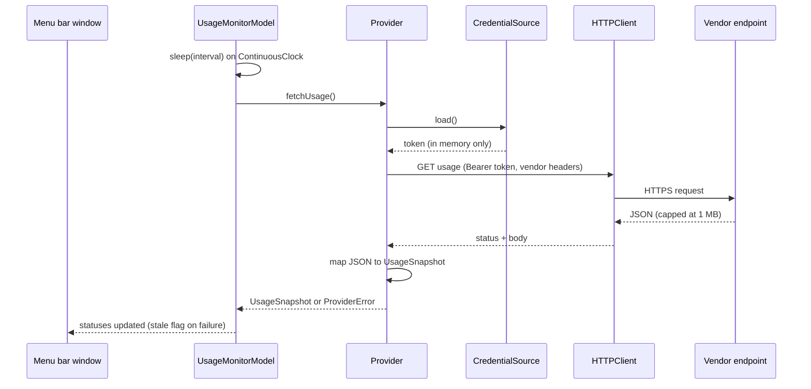

# AI Usage Monitor

A macOS menu bar extra that shows how much of your **Claude**, **OpenAI (ChatGPT / Codex)** and
**Grok** subscription limits you have used, with session and weekly windows and reset times,
refreshed in the background every few minutes.

> **Status:** early development. Not yet released.

> **Unofficial.** None of these vendors publishes an API for subscription usage. This app reads
> the same undocumented endpoints their own CLIs use, with the credentials those CLIs already
> store on your Mac. Endpoints can change or close without notice, and their use is at your
> discretion. See [Security and privacy](#security-and-privacy) and
> [ADR 0003](docs/adr/0003-unofficial-usage-endpoints-and-terms-posture.md).

## Table of contents

- [Features](#features)
- [Requirements](#requirements)
- [Installation](#installation)
- [Usage](#usage)
- [Configuration](#configuration)
- [Architecture](#architecture)
- [Security and privacy](#security-and-privacy)
- [Development](#development)
- [Roadmap](#roadmap)
- [Contributing](#contributing)
- [License](#license)

## Features

- Lives in the menu bar; no Dock icon. Click the icon to see every linked provider at a glance.
- **Claude:** current 5-hour session, weekly "all models", and weekly per-model windows, with
  "Resets in 4 hr 50 min" style countdowns and your plan name.
- **OpenAI:** the 5-hour and weekly Codex/ChatGPT windows shown as percent used or left, with
  reset time and plan type.
- **Grok (experimental):** weekly credit usage percent and period end, with subscription tier.
- Choose which providers to show and how often to refresh (1, 2, 5, 10 or 15 minutes).
- Re-link a provider from Settings after you log in to its CLI again.
- Optional launch at login.
- No accounts, no telemetry, no stored tokens.

## Requirements

- macOS 26 (Tahoe) or later. macOS 27 is supported. Apple silicon or Intel.
- At least one of the vendor CLIs installed and logged in on this Mac:
  - [Claude Code](https://docs.claude.com/en/docs/claude-code) (`claude login`)
  - [Codex CLI](https://github.com/openai/codex) (`codex login`) using ChatGPT sign-in with the
    default file credential storage
  - [Grok Build CLI](https://x.ai/news/grok-build-cli) (`grok login`)

## Installation

Pre-built, notarised releases are planned. Until then, build from source (see
[Development](#development)).

## Usage

1. Launch the app. The onboarding window lists the three providers and shows which CLI logins
   were detected.
2. Click **Link** next to each provider you want to monitor. For Claude, macOS will ask whether
   the app may read the Claude Code item in your keychain; choose **Always Allow**.
3. Close the window. The app keeps running in the menu bar and refreshes on your chosen
   interval. Click the menu bar icon to open the usage panel; use **Refresh now** to force an
   update.

If a provider shows **Re-link needed**, run that CLI's login command again and click **Re-link**
in Settings.

## Configuration

Open **Settings** from the usage panel.

| Tab | What it does |
|---|---|
| Accounts | Shows link state, plan and credential source per provider; re-link or unlink |
| Providers | Choose which providers appear in the panel |
| Refresh | Refresh interval (1, 2, 5, 10, 15 minutes) and launch at login |
| Diagnostics | Poll counts, last errors and a redacted report you can attach to bug reports |

Settings are stored in `UserDefaults`. No credential is ever stored by the app.

## Architecture

The app is a thin SwiftUI target over a local Swift package, `UsageMonitorCore`, that owns all
logic and carries the test suite. Decisions are recorded in [`docs/adr`](docs/adr).

```mermaid
flowchart LR
    subgraph App["App target (SwiftUI)"]
        MBE[MenuBarExtra window]
        SET[Settings window]
        ONB[Onboarding]
    end
    subgraph Core["UsageMonitorCore (Swift package)"]
        MODEL[UsageMonitorModel<br/>@MainActor @Observable]
        POLL[Polling scheduler<br/>Task + ContinuousClock]
        SETTINGS[SettingsStore]
        subgraph Providers
            CL[Claude provider]
            OA[OpenAI provider]
            GK[Grok provider]
        end
        CRED[Credential readers<br/>Keychain / files]
        HTTP[HTTPClient<br/>URLSession, 1 MB cap]
        OBS[Observability<br/>os.Logger, signposts, counters]
    end
    subgraph Mac["Credential stores on this Mac"]
        KC[(Keychain item<br/>Claude Code-credentials)]
        CX[(~/.codex/auth.json)]
        GR[(~/.grok/auth.json)]
    end
    subgraph Vendors["Vendor usage endpoints (unofficial)"]
        A1[api.anthropic.com/api/oauth/usage]
        O1[chatgpt.com/backend-api/wham/usage]
        G1[cli-chat-proxy.grok.com/v1/billing]
    end
    MBE & SET & ONB --> MODEL
    MODEL --> POLL --> CL & OA & GK
    MODEL --> SETTINGS
    CL --> CRED --> KC
    OA --> CRED --> CX
    GK --> CRED --> GR
    CL & OA & GK --> HTTP
    HTTP --> A1 & O1 & G1
    POLL --> OBS
```

One poll cycle:



Key points:

- Providers are isolated adapters: a credential source, one read-only request and a pure
  mapper with recorded JSON fixtures. Endpoint drift breaks one adapter and its tests, not the
  app.
- All effects sit behind protocols with in-memory fakes, which is how the package reaches its
  90% coverage gate without signing or a GUI.
- Failures degrade per provider: the last successful snapshot stays visible, marked stale, and
  the provider backs off exponentially on 429 and 5xx.

## Security and privacy

- The app **never stores** a vendor token, cookie or refresh token. It reads the credential the
  vendor's own CLI stored, uses it for one request, and discards it.
- It **never refreshes** tokens (that could log the CLI out) and **never calls inference
  endpoints**.
- Outbound HTTPS only, App Transport Security enforced, Hardened Runtime on, App Sandbox where
  the platform allows.
- Logs are redacted at source and nothing leaves your Mac. There is no telemetry.
- Full details: [SECURITY.md](SECURITY.md), [ADR 0002](docs/adr/0002-reuse-official-cli-credentials-no-token-persistence.md),
  [ADR 0004](docs/adr/0004-app-sandbox-with-read-only-exceptions.md),
  [ADR 0006](docs/adr/0006-local-only-observability.md).

Terms of service: all three vendors' consumer terms restrict automated access. This project
performs low-rate, read-only requests with your own token, which is a grey area none of the
vendors has explicitly sanctioned. You choose per provider whether to opt in.

## Development

```sh
brew install xcodegen swiftlint
git clone https://github.com/jig21nesh/usage-monitor-app.git
cd usage-monitor-app
cp Config/Local.xcconfig.example Config/Local.xcconfig   # set DEVELOPMENT_TEAM
scripts/bootstrap.sh                                      # generates UsageMonitor.xcodeproj
open UsageMonitor.xcodeproj
```

Run the tests and the coverage gate without Xcode signing:

```sh
swift test --package-path Packages/UsageMonitorCore --enable-code-coverage
scripts/coverage-gate.sh
```

Project rules for contributors and AI assistants live in [`CLAUDE.md`](CLAUDE.md). See
[CONTRIBUTING.md](CONTRIBUTING.md) for the workflow.

## Roadmap

- Notarised release builds and a Homebrew tap.
- Menu bar icon states that reflect the most-used window.
- Notifications when a window crosses a threshold.
- Support for Codex keyring credential storage.

## Contributing

Issues and pull requests are welcome. Please read [CONTRIBUTING.md](CONTRIBUTING.md) and the
[Code of Conduct](CODE_OF_CONDUCT.md) first.

## License

[MIT](LICENSE). Copyright (c) 2026 Jignesh Kakkad.

Claude is a trademark of Anthropic, PBC. ChatGPT and Codex are trademarks of OpenAI. Grok is a
trademark of xAI. This project is not affiliated with or endorsed by any of them.
